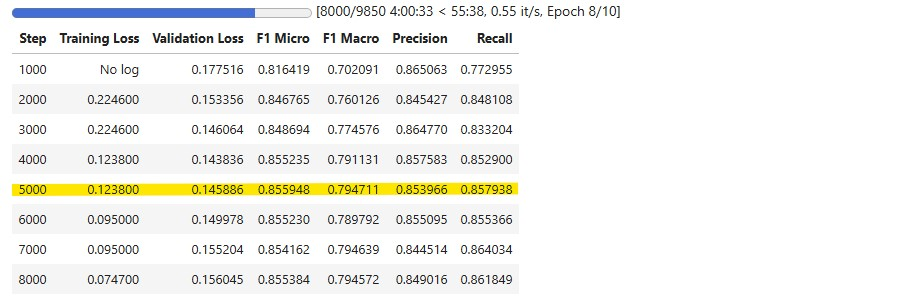

# Trainings- und Vorhersageschritte

## Übersicht

Dieses Dokument beschreibt den vollständigen Prozess, den wir durchgeführt haben, um einen Trainingsdatensatz zu erstellen, ihn zu labeln, ein Modell zu trainieren und Vorhersagen zu treffen – unter Verwendung eines maßgeschneiderten Multi-Label-Klassifikationsmodells. Unser Workflow stellt Fairness, Ausgewogenheit und Effizienz in jedem Schritt sicher, um hochwertige Ergebnisse zu erzielen.

---

## Schritt 1: Sampling-Strategie der Reviews

Um eine faire Verteilung aller Bewertungssterne sicherzustellen, haben wir folgende Sampling-Strategie angewendet:

- Proportionale Repräsentation **aller Bewertungssterne (1 bis 5)** innerhalb aller Reviews.
- Diese Methode führte zu einem **ausgewogenen Datensatz**, der beim Training eine bessere Generalisierung ermöglicht.

Zur Optimierung der Trainingseffizienz:

- Wir haben die **Review-Länge auf maximal 256 Tokens** begrenzt.
- Längere Texte erzeugten oft mehr Rauschen, ohne die Modellleistung zu verbessern.
- Diese Begrenzung reduzierte auch **Trainingszeit und GPU-Speichernutzung**.

Insgesamt haben wir **70.000 ausgewogene und gekürzte Reviews** gesammelt.

[Codereferenz](./random_sampling_per_business_by_token_stars.py)

---

## Schritt 2: Labeling mit LLM-APIs

Um hochwertige Labels für das Training zu generieren, sind wir wie folgt vorgegangen:

1. **Erster Versuch**:
   - Wir testeten die **ChatGPT API** mit 5.000 Reviews und einem einfachen Prompt.
   - Die Genauigkeit war nach manueller Prüfung **nicht zufriedenstellend**.
   - Trotz unserer klaren Regel, dass nur 20 festgelegte Labels verwendet werden dürfen, hat das Modell **über 140 zusätzliche, nicht definierte Labels** erzeugt – was die Ergebnisse **unbrauchbar** machte.

2. **Verbesserte Strategie**:
   - Wir entwickelten einen **optimierten Prompt**.
   - Der Wechsel zur **DeepSeek API** brachte bessere, stabilere und konsistentere Ergebnisse.
   - Mit DeepSeek und dem verfeinerten Prompt konnten wir **alle 70.000 Reviews erfolgreich labeln**.

[Codereferenz](./deepseek.py)

---

## Schritt 3: Modelltraining

Wir trainierten ein Multi-Label-Klassifikationsmodell mit folgenden Spezifikationen:

- **Basismodell**: RoBERTa (von Facebook AI)
- **Plattform**: Kaggle (aufgrund leistungsstarker GPU-Ressourcen)
- **Trainingsdaten**: 70.000 gelabelte Reviews
- **Trainingsdauer**: ~5 Stunden

Dank der sorgfältigen Auswahl und Bereinigung der Daten erzielte das Modell **ausgezeichnete Evaluierungsergebnisse**.

  

### Warum Schritt 5000 gewählt wurde

Sowohl Schritt 4000 als auch 5000 zeigen starke Leistungen, aber **Schritt 5000** wurde aus folgenden Gründen ausgewählt:
- **Höchster F1 Micro-Wert**: 0.855948 (beste Gesamtgenauigkeit).
- **Höchster F1 Macro-Wert**: 0.794711 (beste Balance über alle Labels hinweg).
- **Gutes Verhältnis von Precision & Recall**: bester Recall-Wert aller Schritte.
- **Stabiler Loss**: Training Loss blieb bei 0.1238, Validation Loss stieg nur minimal.

[Codereferenz](./kaggle_train_notebook.ipynb)  
[Modell](./model/final_model_70k.zip)

---

## Schritt 4: Review-Vorhersage (Gesamter Datensatz)

Nach dem erfolgreichen Training nutzten wir das Modell zur Vorhersage von **allen 3.500.000 Reviews** im Datensatz:

- Die Reviews wurden **einzeln verarbeitet** und die Vorhersagen in der Datei `review_label.csv` gespeichert.
- Für Reviews mit **mehr als 256 Tokens** implementierten wir einen **Chunking-Mechanismus**:
  - Jeder Text wurde in **Chunks à 256 Tokens** aufgeteilt.
  - Die Vorhersagen erfolgten **chunkweise**, um Informationsverlust zu vermeiden.
- Wieder setzten wir Kaggle ein, um von der **GPU-Beschleunigung** zu profitieren.
- **Gesamtdauer der Vorhersage**: ca. 21 Stunden.

Ergebnis: ein vollständig gelabelter Datensatz mit **3,4 Millionen Reviews**, bereit für die Analyse.

- [Codereferenz](./kaggle_peredict_labeling.ipynb)
- [review_label.zip](../data/review_label.zip)

---

## Zusammenfassung

| Schritt             | Beschreibung                                             |
|---------------------|----------------------------------------------------------|
| Sampling            | aller Bewertungssterne (1 bis 5)** innerhalb aller Reviews |
| Token-Filterung     | Maximal 256 Tokens pro Review                            |
| Labeling            | DeepSeek API mit verfeinertem Prompt                     |
| Modell              | Facebook AI RoBERTa                                      |
| Trainingsplattform  | Kaggle (5 Stunden)                                       |
| Vorhersage          | Chunked >256 Tokens, 3,4 M Reviews, Kaggle (21 Stunden)  |
| Output              | `review_label.csv` mit vorhergesagten Labels           |

---

